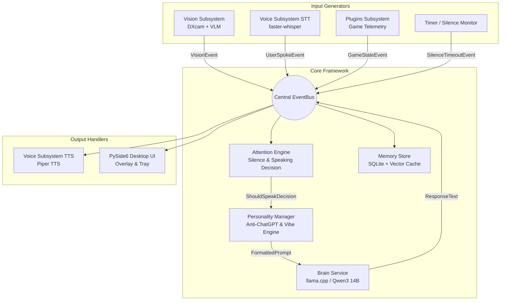

# DiscordBuddy Architecture & System Design

## System Overview

**DiscordBuddy** is designed around an asynchronous, decoupled, **event-driven architecture**. All subsystems (Vision, Voice STT/TTS, Attention Engine, Memory, Personality, Brain LLM, Plugins, UI) communicate via a central `EventBus`.



---

## Key Modules & Responsibilities

| Module | Location | Primary Responsibilities |
|---|---|---|
| **Core EventBus** | `discordbuddy.core.event_bus` | Asynchronous pub/sub event router with priority queues and event filtering. |
| **Conversation Manager** | `discordbuddy.core.conversation_manager` | Orchestrates UserSpoke events, attention evaluation, brain generation, and voice response synthesis. |
| **Config** | `discordbuddy.config` | Strongly typed Pydantic settings loading hardware and module parameters. |
| **Logging** | `discordbuddy.utils.logging` | Loguru structured logger writing to console and rotating log files. |
| **Vision** | `discordbuddy.vision` | DXcam screen capture, frame difference filtering, Qwen2.5-VL event extraction. |
| **Voice** | `discordbuddy.voice` | Audio stream VAD, STT (`faster-whisper`), TTS (`piper-tts`) audio output. |
| **Attention** | `discordbuddy.attention` | Evaluates incoming events against silence duration, user speech, and reaction threshold matrix. |
| **Personality** | `discordbuddy.personality` | Constructs system prompts, enforces 3–12 word limit, applies anti-ChatGPT filters. |
| **Brain** | `discordbuddy.brain` | Manages local LLM inference (supports `llama-cpp-python` and OpenAI-compatible local APIs). |
| **Memory** | `discordbuddy.memory` | SQLite database storing conversation history, game events, and persistent user relationship context. |
| **Plugins** | `discordbuddy.plugins` | Plugin discovery and lifecycle manager for external game state integrations. |
| **UI** | `discordbuddy.ui` | PySide6 desktop interface, system tray icon, floating vibe status indicator. |

---

## Hardware Resource Budget (Windows 11)

Target Hardware:
- **GPU**: AMD Radeon RX 6700 XT 12GB VRAM
- **CPU**: Intel Core i5-12400F
- **RAM**: 16GB - 32GB System RAM

### VRAM Allocation Budget (12 GB Total):
```
┌─────────────────────────────────────────────────────────────┐
│ Qwen3 14B Q4_K_M (LLM Brain):                   ~7.5 GB     │
│ Qwen2.5-VL 3B Q4_K_M (Vision VLM):               ~2.5 GB     │
│ PyTorch / Audio VAD / System Overhead:          ~1.5 GB     │
│ Free Buffer for Windows DWM:                     ~0.5 GB     │
└─────────────────────────────────────────────────────────────┘
```

---

## Event Execution Lifecycle

1. **Screen Change / Speech**: A screen event occurs (e.g. `BossAppeared`).
2. **Event Dispatch**: Vision subsystem creates a `BossAppearedEvent` and calls `event_bus.publish(event)`.
3. **Memory Capture**: `MemoryStore` logs the event asynchronously into the SQLite database.
4. **Attention Score**: `AttentionEngine` evaluates the event:
   - Was AI silent for > 30s? (+0.4)
   - Is event high intensity (`BossAppeared`)? (+0.5)
   - Is user currently talking? (-0.8)
   - Total Score > Threshold -> **APPROVED TO SPEAK**.
5. **Prompt Assembly**: `PersonalityManager` creates a compact, casual prompt with Anti-ChatGPT guidelines.
6. **Inference**: `BrainService` queries local Qwen3 14B model -> Output: *"Oh boy, here we go."*
7. **Synthesis**: `VoicePipeline` synthesizes speech via Piper TTS and plays back in speaker/Discord virtual audio.
