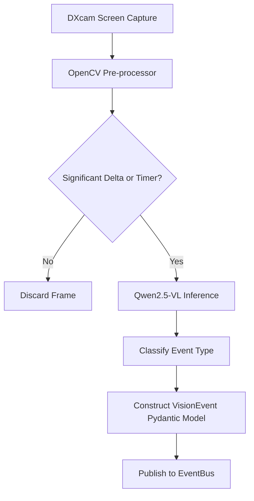

# Vision Pipeline & Event Extraction Specification

## Overview

The Vision subsystem in **DiscordBuddy** enables the AI companion to "watch" the user's screen without continuously invoking heavy Multimodal LLM (VLM) inferences. 

Continuous VLM inference (e.g., 30 FPS screenshot analysis with Qwen2.5-VL 7B) would completely exhaust GPU resources (AMD RX 6700 XT 12GB), destroy frame rates during gaming, and generate excessive noise.

Instead, the Vision pipeline uses a **two-tier capture & event filtering architecture**:
1. **Tier 1 (High Speed, Ultra Low Overhead)**: DXcam + OpenCV for fast frame capture (2–5 FPS) and lightweight frame-difference / color histogram heuristic detection.
2. **Tier 2 (Event-Triggered VLM Inference)**: When Tier 1 detects a notable screen delta or periodic sampling timer, a frame is sent to Qwen2.5-VL 3B/7B to classify high-level events.

---

## Screen Capture Engine: DXcam

- **Technology**: `DXcam` leverages Desktop Duplication API (DXGI) in Windows 11.
- **Performance target**: Capture target area at 60+ FPS if needed, sampled down to 2–5 FPS processing loop with sub-millisecond CPU overhead.
- **Region of Interest (ROI)**: Fullscreen game capture or selected display monitor.

---

## Vision Processing Pipeline



---

## Event Catalog

The Vision module maps screen states to structured visual events:

| Event Type | Description | Trigger Criteria |
|---|---|---|
| `BossAppeared` | A massive boss health bar or entity appeared | Screen ROI exhibits large health bar overlay or VLM classification |
| `FunnyDeath` | User character died in a hilarious/unexpected way | "YOU DIED" / "GAME OVER" screen overlay detected |
| `LargeExplosion` | Sudden intense screen flash / particle bloom | High brightness/contrast surge across >40% screen area |
| `CutsceneStarted` | Aspect ratio change to cinematic letterbox | Black bars top/bottom detected + HUD hidden |
| `BeautifulScenery` | Panorama / scenic vista detected | High color saturation + low UI element density |
| `UserLaughed` | (Combined with Audio) visual reaction trigger | Sudden webcam or gameplay movement spike |
| `SilenceTimeout` | Screen static or idle gameplay | Low visual change for >45 seconds |

---

## VLM Inference Optimization

To keep VLM inference fast and lightweight:
- **Resolution Downscaling**: Images are resized to `768x432` or `1024x576` before feeding into Qwen2.5-VL.
- **Quantization**: Qwen2.5-VL 3B / 7B quantized in `Q4_K_M` or `IQ4_XS` format via `llama-cpp-python`.
- **System Prompt**: VLM is strictly constrained to output JSON objects matching the schema:
```json
{
  "event_type": "BossAppeared",
  "confidence": 0.92,
  "description": "Red boss health bar at the top with text 'Malenia, Blade of Miquella'",
  "visual_tags": ["boss", "healthbar", "elden_ring"]
}
```

---

## Hardware Budget for Vision

- **VRAM Allocation**: ~2.5 GB reserved for Qwen2.5-VL 3B Q4_K_M.
- **CPU Usage**: < 3% Intel i5-12400F usage for DXcam capture loop.
- **Execution Interval**: Maximum 1 VLM inference every 3–5 seconds.
